This folder holds some media regarding The MuffinTime Resourcepack.

#### The MuffinTime Resourcepack Icon
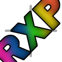

#### The MuffinTime Resourcepack static & dynamic overview

  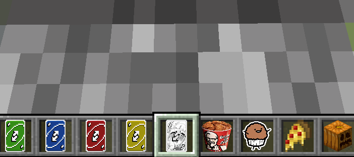
  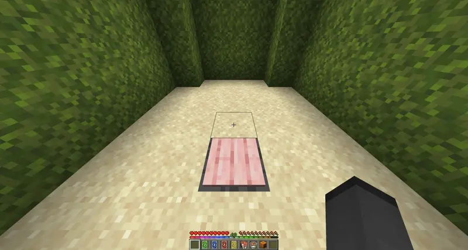

1. Rainbow xp and locator bar
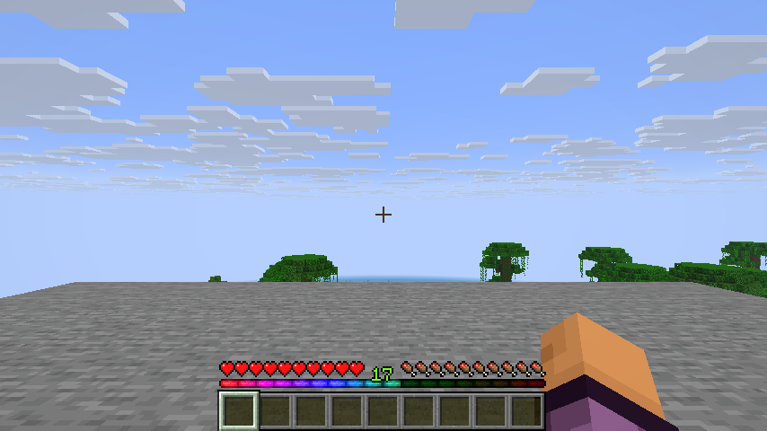

2. Furnaces have the name DOOOOOOOG
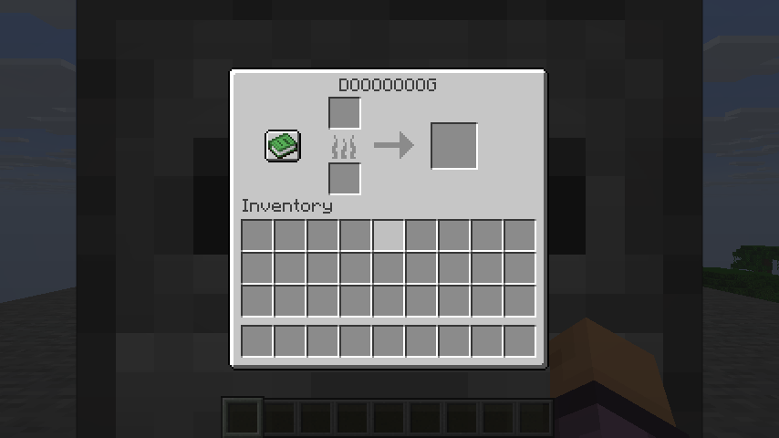

3. The cookie texture is the MuffinTime logo.
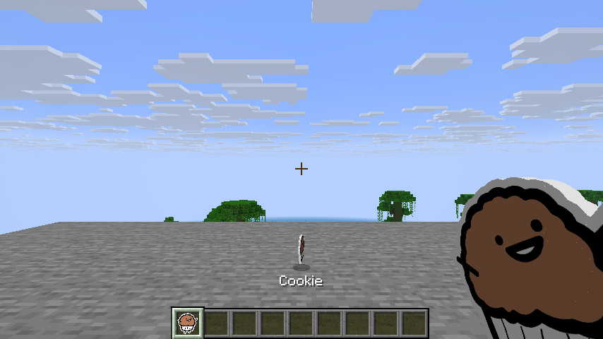

4. Default green UNO totem texture
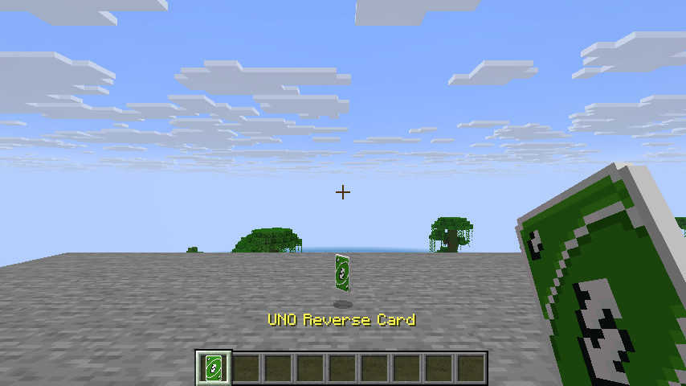

5. The text of the totem has been adjusted to be fitting for a UNO Reverse Card
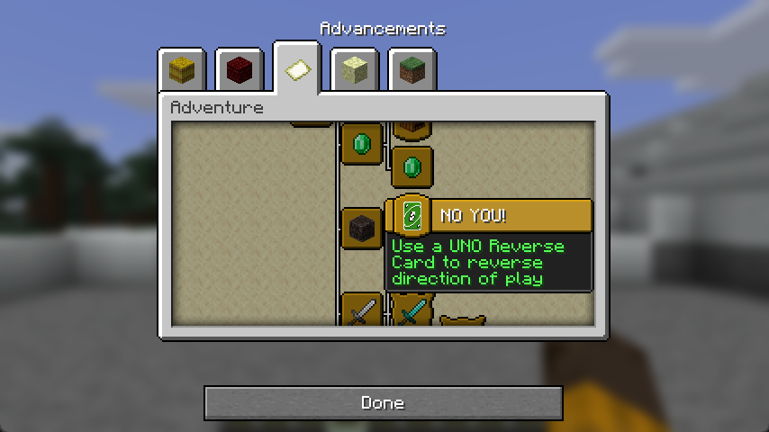

6. Diffrent Totem textures
    

      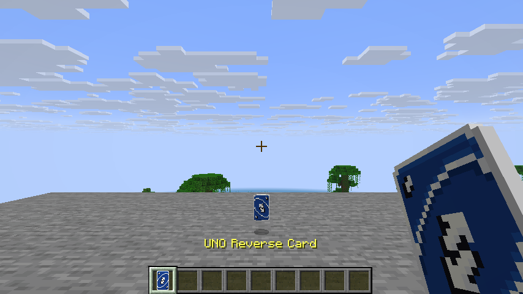
      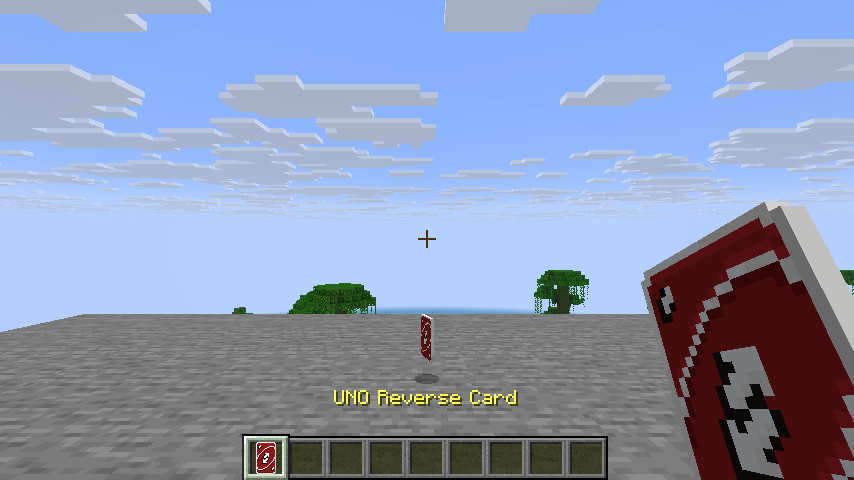
      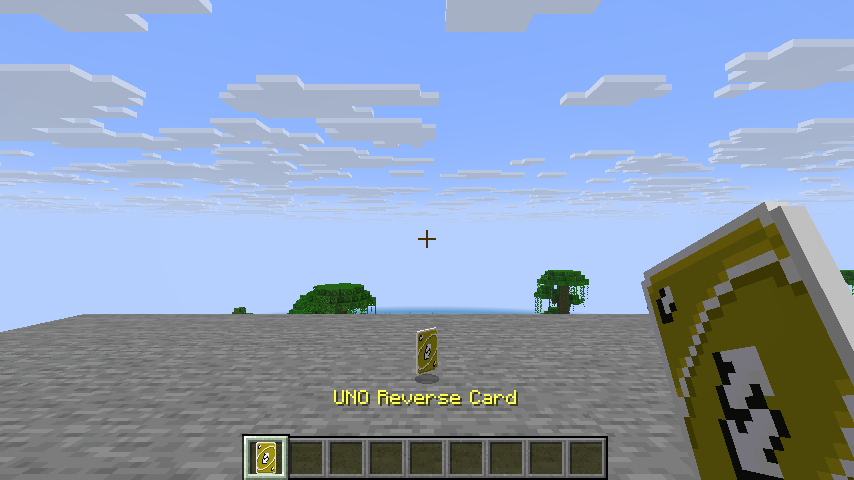
    

    Some frames of the animated ahegao totem
    

      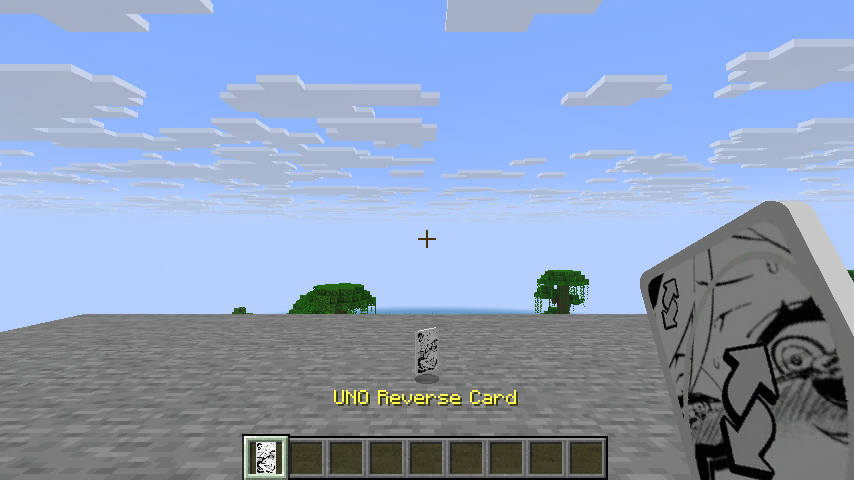
      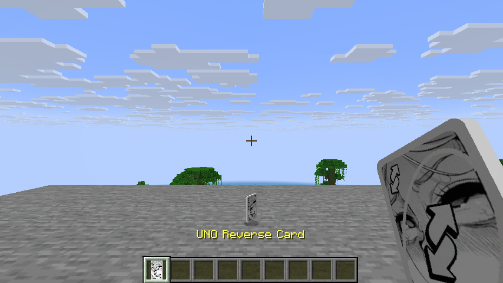
      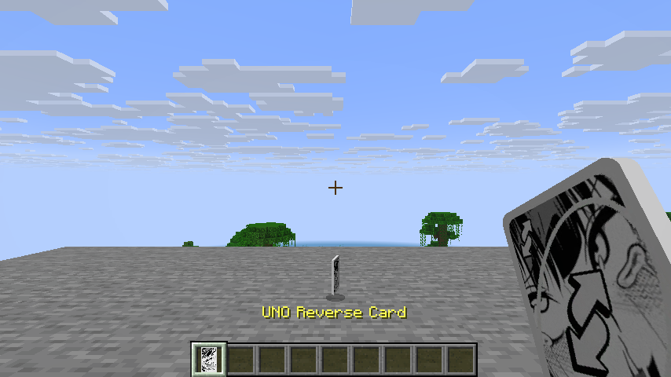
    

7. The cooked chickens texture is a KFC bucket
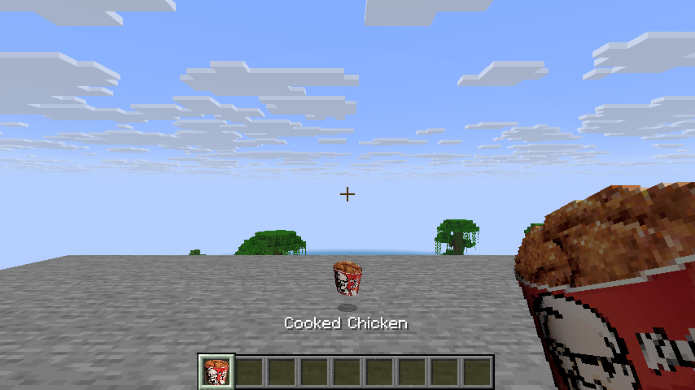

8. No image available to display sounds. :)

9. Custom carved pumkin on head slot equipped 
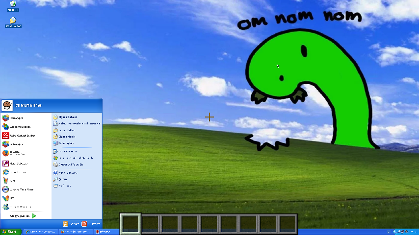

10. Golden carrots are tasty pizza slices
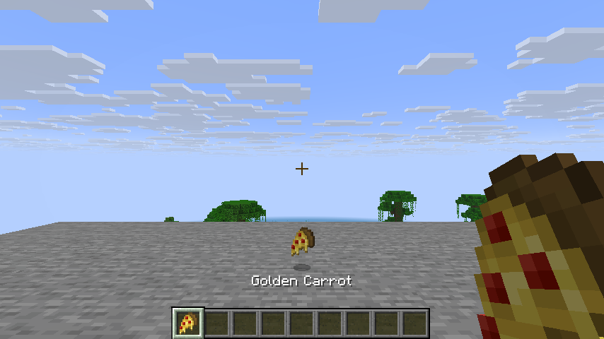

11. Firework rockets are SpaceX rockets
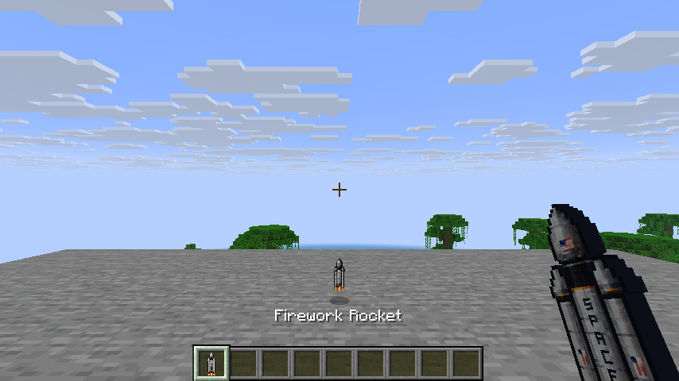